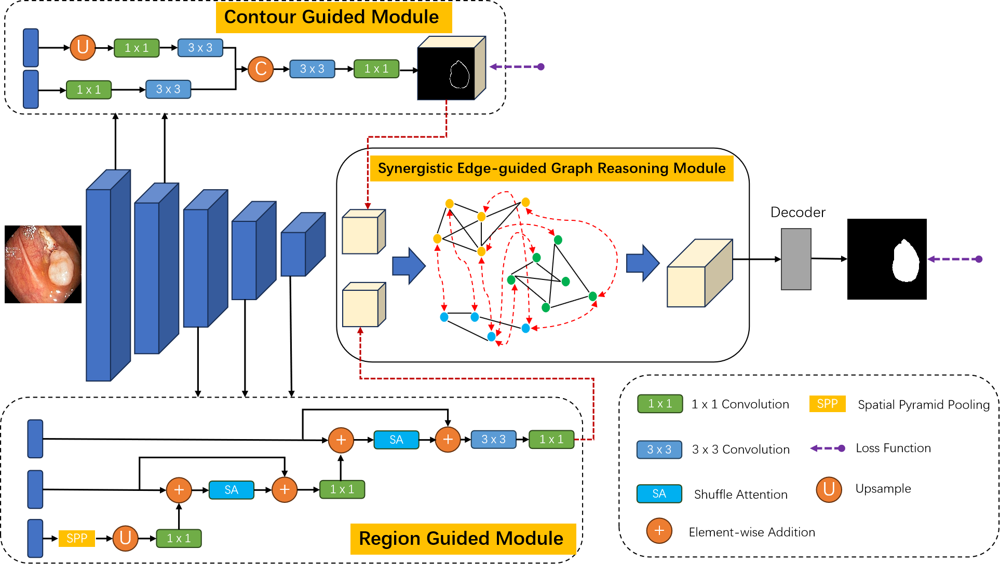
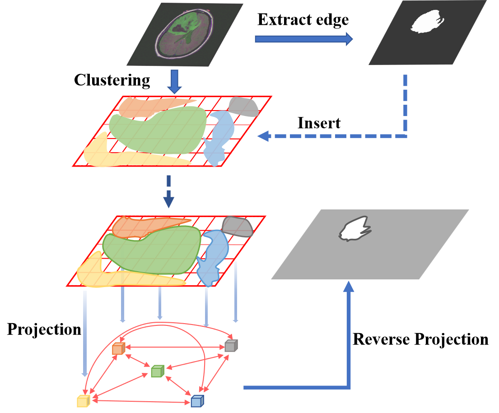
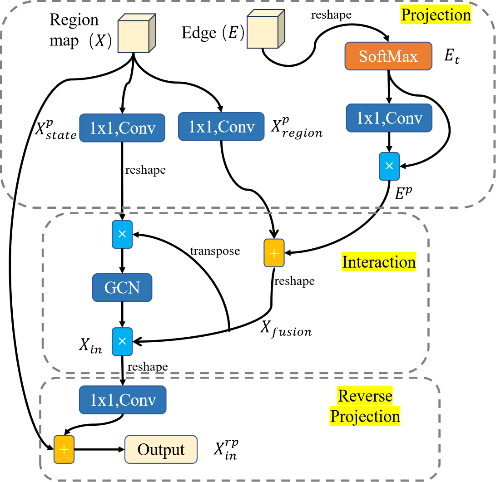
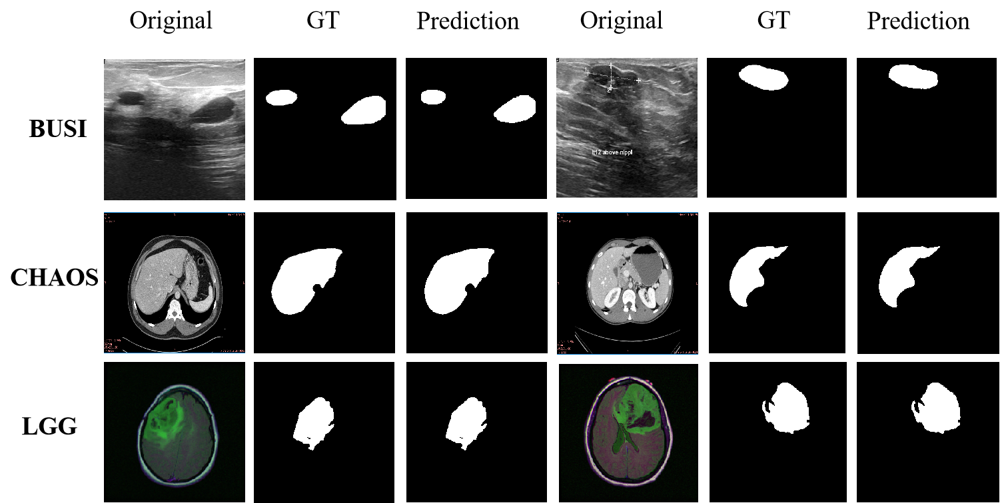

# SEGRNet：GENERALIZED SYNERGISTIC EDGE-GUIDED GRAPH REASONING NETWORK FOR BIOMEDICAL IMAGE SEGMENTATION
This is the official implementation code for article named "GENERALIZED SYNERGISTIC EDGE-GUIDED GRAPH REASONING NETWORK FOR BIOMEDICAL IMAGE SEGMENTATION".

## Overview

SEGRNet is a novel and generalized framework for biomedical image segmentation that synergistically combines convolutional feature extraction with graph-based global reasoning. SEGRNet effectively models complex anatomical structures and captures long-range dependencies, addressing key limitations of conventional segmentation methods.

**Key Features：**
- **Edge-Guided Graph Reasoning:** Regions and edges are projected into a graph domain, where adaptive interaction between local and global features is achieved via a graph convolutional network (GCN).
- **Convolutional Backbone:** Leverages the power of convolutions for robust local feature extraction.
- **Bidirectional Mapping:** Pixel-level features are mapped to and from the graph domain, ensuring refined regional and boundary predictions.
- **Generalizability:** Demonstrated strong and consistent performance on a wide range of biomedical imaging modalities.

### Synergistic Edge-Guided Graph Reasoning (SEGR) module
|  |  |
| :--: | :--: |
| **Schema of graph reasoning** | **Structure of SEGR module** |

## Experimental results

## :black_nib: For citation

:exclamation: :eyes: **The codes can not be used for commercial purposes!!!**

